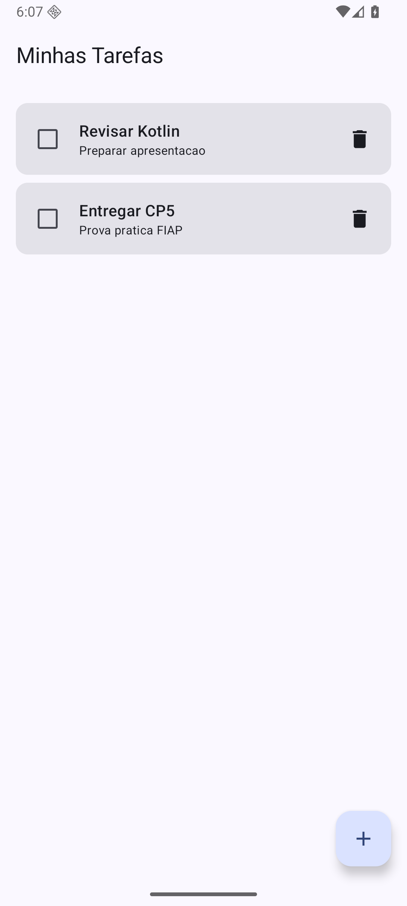
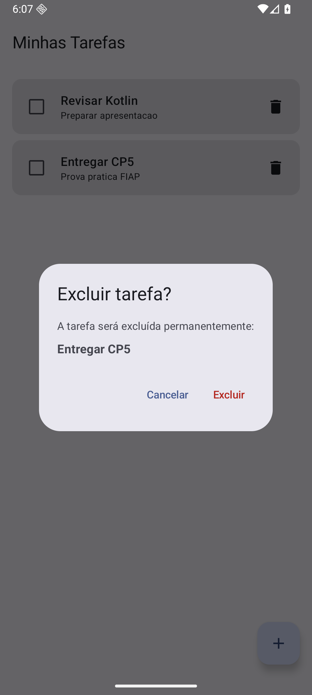
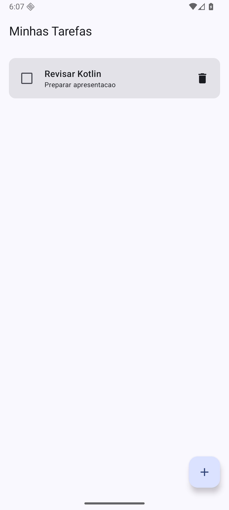

# Evidências — confirmação de exclusão

Fluxo realizado no emulador **Pixel 6 API 36**, selecionando a tarefa **Entregar CP5** para exclusão.

## 1. Lista antes da exclusão

As tarefas **Revisar Kotlin** e **Entregar CP5** estão cadastradas.

## 2. Diálogo aberto com a tarefa selecionada

O diálogo informa claramente que a exclusão será permanente e apresenta o título **Entregar CP5**.

## 3. Resultado ao cancelar

Após selecionar **Cancelar**, o diálogo é fechado e as duas tarefas permanecem na lista.

## 4. Nova abertura do diálogo

O diálogo é aberto novamente para a mesma tarefa.

## 5. Resultado após confirmar a exclusão

Após selecionar **Excluir**, somente **Entregar CP5** é removida. A tarefa **Revisar Kotlin** permanece na lista.

